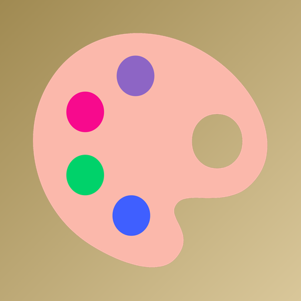
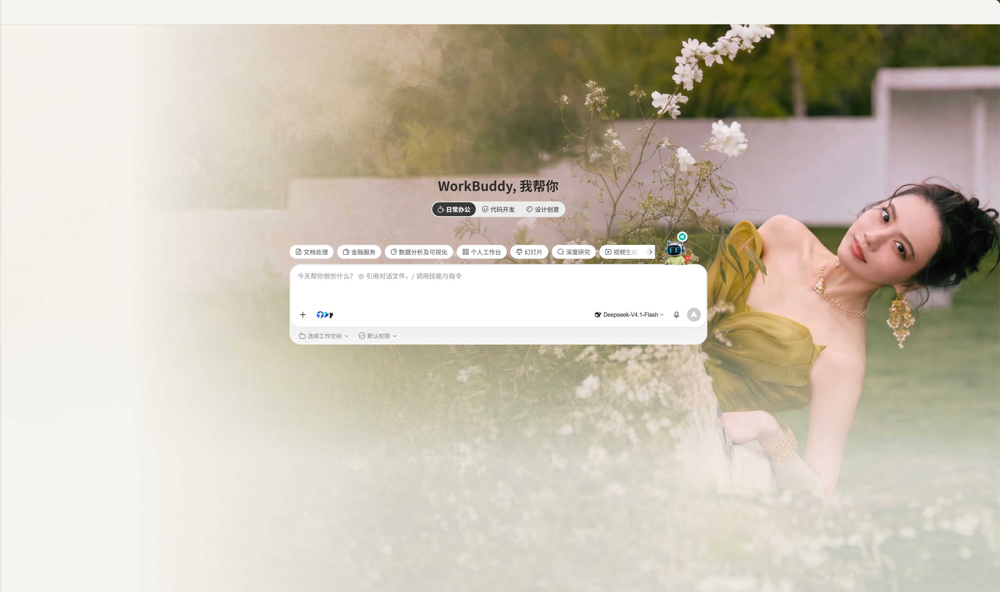
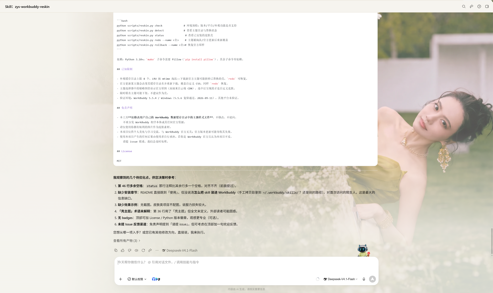

<p align="center">
  
</p>

<h1 align="center">zys-workbuddy-reskin（WorkBuddy 换肤）</h1>

<p align="center">
  <a href="LICENSE"></a>
  <a href="https://www.python.org/"></a>
  <a href="#适用环境重要"></a>
</p>

把任意一张图片变成 WorkBuddy 桌面端的官方主题皮肤——通过「借壳」官方内置主题的方式，
皮肤随官方主题机制生效、跨重启存活，无需调试端口或任何启动器。

> 由 [workbuddy-skin-studio](https://github.com/cdredfox/workbuddy-skin-studio) 项目启发，
> 但实现完全独立：纯 Python 标准库 + Pillow，单文件 CLI。

## 效果示例

| 首页 | 会话页 |
| :---: | :---: |
|  |  |

上图为使用一张人物图自动取色生成的效果：主色取自图片暖金调，首页背景整体铺陈、
会话内容区覆盖 33% 薄纱以保证文字可读。

## 安装

把下面这句话发给 WorkBuddy：

```
请帮我安装这个技能：https://github.com/zhouyubing/zys-workbuddy-reskin
```

WorkBuddy 会拉取仓库并安装到技能目录。安装后无需额外配置，直接在会话里说「换肤」即可。

## 工作原理

1. WorkBuddy 把内置主题（官方外观设置里可切换的那些）缓存于
   `~/.workbuddy/appearance-resources/theme-<key>-<updatedAt>/`，核心是一份 `skin.css`。
2. 客户端命中本地缓存即直接使用，**不校验内容与云端主题包的一致性**。
3. 本工具把一份自包含皮肤 CSS（背景图 base64 内嵌 + `--cb-*` 设计变量覆盖 +
   针对新版界面的透明度规则）覆盖到所选主题目录的全部 `skin.css`。
4. 用户在 设置→外观 选中该主题 → 皮肤经官方合法路径生效；选中动作会让客户端把
   这份 CSS 写入启动缓存 → 冷启动第一时刻挂载且通过云端目录校验 → **跨重启存活**。

## 适用环境（重要）

| 条件 | 要求 |
| --- | --- |
| 客户端 | WorkBuddy **桌面端**（Windows / macOS） |
| 版本 | **≥ 5.5.3**（外观/主题皮肤功能自 5.5.3 上线，更早版本无此功能） |
| 账号 | **个人版**（外观功能不对企业版开放，ultimate/exclusive 被客户端排除） |
| 不支持 | **小程序端、手机 App 端**（无外观功能，也无法运行本 skill） |

首次使用时 skill 会自动运行环境预检（`python scripts/reskin.py check`），不满足条件会给出
对应的升级/切换指引。若你的客户端版本足够但「设置」里找不到「外观」入口，可能是云端灰度
开关尚未对你放开。

## 使用

安装本 skill 后，在会话里说「**换肤**」「**换主题**」即可，AI 会引导完成：

1. 选择一个「壳主题」——即拿哪一款官方内置主题来承载你的皮肤，单选：
   经典QQ / 涟漪 / 有风 / 同行 / 伙伴（选谁不影响效果，只是借它的位置）
2. 提供一张图片（建议明亮、低饱和的横版风景或人像图，≥1600px 宽）
3. 自动压缩、取色、生成 CSS 并覆盖（首次覆盖自动整目录备份）
4. 设置→外观：先选其他主题、再重新选中该主题 → 完成（该动作即刷新缓存，无需重启）

维护命令（也可在会话里用自然语言触发）：

```bash
python scripts/reskin.py check                # 环境预检：版本/平台/外观功能是否支持
python scripts/reskin.py detect               # 查看主题目录与替换状态
python scripts/reskin.py status               # 查看已安装的皮肤壳（按主题最新目录判定）
python scripts/reskin.py doctor               # 健康自检：列出失效皮肤及原因
python scripts/reskin.py doctor --fix         # 一键修复失效皮肤（覆盖前自动备份官方原样）
python scripts/reskin.py redo --name <名>      # 重新覆盖到该主题当前最新目录
python scripts/reskin.py rollback --name <名>  # 恢复官方原样
```

依赖：Python 3.10+；`make` 子命令需要 Pillow（`pip install pillow`），其余子命令零依赖。

## 皮肤失效了怎么办？

WorkBuddy 若回到官方原版主题，最常见的原因是**官方更新了该主题**：官方会新建一个
`theme-<key>-<updatedAt>` 缓存目录并重新下载，客户端随之改用新目录，旧目录里你的皮肤
不再被读取。这属于「借壳」机制的预期行为，不是皮肤损坏，**几秒即可恢复**：

```bash
python scripts/reskin.py doctor        # 自检：哪些皮肤失效、原因是什么
python scripts/reskin.py doctor --fix  # 一键修复（覆盖前自动备份官方原样）
```

修复后进入 **设置 → 外观**，先选另一个主题、再重新选中你的壳主题，即可刷新缓存
（**实测无需重启**）。

装好本 skill 后，也可以直接用自然语言说「我的皮肤失效了」，AI 会自动完成上述自检与修复。

## 已知限制

- **官方更新主题会导致皮肤失效**（最常见）：官方会新建 `theme-<key>-<updatedAt>` 缓存目录并
  重新下载，客户端随之改用新目录，旧目录里的自定义 CSS 不再被读取，界面回到官方原样。
  这不是皮肤损坏——运行 `doctor --fix` 即可恢复，无需重新制作。
- 外观缓存目录上限 8 个，LRU 按 mtime 淘汰——下载新官方主题可能挤掉已替换的壳。
  `doctor` 会报「该主题已无本地缓存」，此时需先在 设置→外观 启用一次该主题，再 `redo`。
- 主题选择器中的缩略图仍显示官方原图（封面来自云端 CDN），选中后呈现的才是自定义皮肤。
- 限时联名主题可能下架，不建议作为壳。
- 验证环境：WorkBuddy 5.5.4 / Windows（5.5.6 复验通过，2026-09-11；2026-09-14 复验
  「官方更新致失效 → doctor --fix 恢复」全流程）。其他平台未验证。

## 免责声明

- 本工具**仅修改用户自己的 WorkBuddy 数据缓存目录中的主题样式文件**，不修改、不逆向、
  不重分发 WorkBuddy 程序本体或其任何官方资源。
- 请仅使用你拥有权利的图片作为皮肤素材。
- 本项目仅供个人美化与学习交流，与 WorkBuddy 官方无关；官方版本更新可能导致其失效。
- 使用本项目产生的任何后果由使用者自行承担。若你是 WorkBuddy 官方且认为本项目不妥，
  请提 issue 联系，我们会及时处理。

## 反馈与贡献

使用中遇到问题或有改进建议，欢迎[提 Issue](https://github.com/zhouyubing/zys-workbuddy-reskin/issues)。
如果这个小工具帮你把 WorkBuddy 变得更顺眼，给个 Star 是很好的鼓励。

## License

MIT
